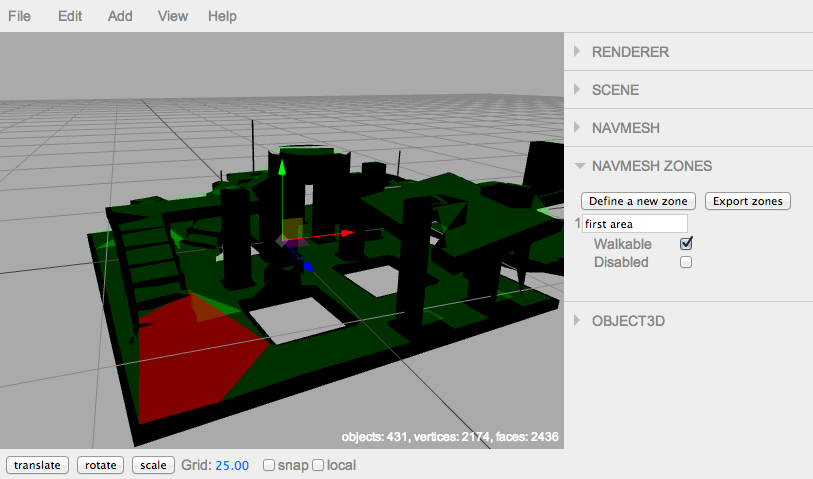

recastjs-editor
===============

A navmesh editor leveraging [recast.js](https://github.com/vincent/recast.js) and the [three.js](https://github.com/mrdoob/three.js) editor.

With this editor addon, one can define zones from a recast.js navmesh, to manage them from your scene at runtime.
